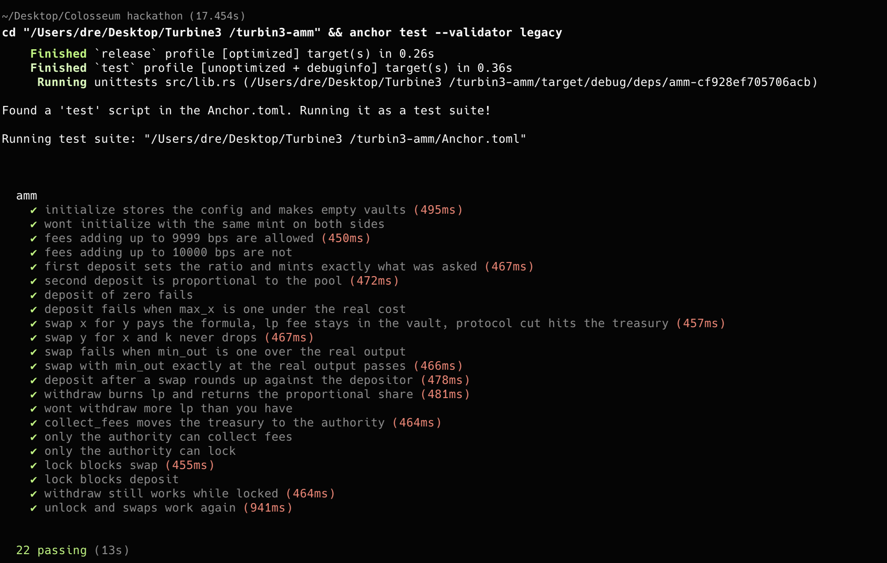

# AMM

Week 3 for Turbin3. A constant product market maker, x times y equals k, with swap fees
and a treasury. The math is written out by hand, no `constant-product-curve` crate.

One pool holds two tokens. LPs put both in and get LP tokens back. Traders swap one for the
other and the price comes from the ratio in the vaults. Every swap skims a fee, most of it
stays in the pool for the LPs and a slice goes to a treasury the admin can collect.

## Running it

```bash
pnpm install
anchor build
anchor test --validator legacy
```

You need `--validator legacy`. Anchor 1.0 goes for Surfpool by default and I don't have
Surfpool installed, so without the flag it just dies with `Failed to spawn 'surfpool'`.

22 tests pass.



---

## How it works

One `Config` PDA per pool, seeded `["config", seed]`.

```rust
pub struct Config {
    pub seed: u64,
    pub authority: Pubkey,   // can lock, unlock, collect fees
    pub mint_x: Pubkey,
    pub mint_y: Pubkey,
    pub fee: u16,            // bps, stays in the vaults for LPs
    pub protocol_fee: u16,   // bps, goes to the treasury
    pub locked: bool,
    pub config_bump: u8,
    pub lp_bump: u8,
    pub treasury_bump: u8,
}
```

Around it:

| account | seeds / owner | what |
|---|---|---|
| `mint_lp` | `["lp", config]` | LP token mint, config is the mint authority |
| `vault_x`, `vault_y` | ATAs owned by `config` | the actual liquidity |
| `treasury` | `["treasury", config]` | empty PDA, exists to own the two below |
| `treasury_x`, `treasury_y` | ATAs owned by `treasury` | protocol fees pile up here |

Seven instructions:

- `initialize(seed, fee, protocol_fee)` makes the config, LP mint, both vaults, both treasury accounts
- `deposit(amount, max_x, max_y)` pay x and y, get `amount` LP tokens
- `withdraw(amount, min_x, min_y)` burn `amount` LP tokens, get x and y back
- `swap(is_x, amount_in, min_out)` pay one side, get the other
- `lock()` / `unlock()` admin circuit breaker
- `collect_fees()` admin empties the treasury into their own wallet

Config signs for the vaults and the LP mint. Treasury signs for the treasury accounts.
Users sign for their own stuff. Nobody holds a key to any of the pool's tokens.

### The math

All of it is in `curve.rs`. Three functions, every multiply goes through `u128` and every
op is `checked_`, so a bad input turns into an error instead of a wrapped number.

Deposit. First one in sets the price, they pay `max_x` and `max_y` and get `amount` LP
tokens for it. After that you pay the pool's current ratio:

```
x = ceil(amount * vault_x / supply)
y = ceil(amount * vault_y / supply)
```

Withdraw is the same thing backwards, rounded the other way:

```
x = floor(amount * vault_x / supply)
y = floor(amount * vault_y / supply)
```

Swap. Fees come off the top first, then the constant product formula runs on what's left:

```
net = amount_in - fee - protocol_fee
out = floor(vault_out * net / (vault_in + net))
```

That last line is `x * y = k` rearranged. Put `net` more x in, the pool gives back exactly
enough y that the product doesn't drop. Floor means it never gives back one unit too many,
so k can only go up. One of the tests checks that directly.

### Rounding

Every division rounds against whoever is calling. Deposit rounds what you pay up.
Withdraw rounds what you get down. Swap rounds the output down. If any of these went the
other way you could loop tiny deposits and withdrawals and pull the pool apart a unit at
a time. Same story as my vault from week 2.

### Fees and the treasury

Two numbers in basis points. `fee` is the LP fee. `protocol_fee` is the protocol's cut.
Both are checked as `fee + protocol_fee < 10000` on initialize, strictly under, because at
exactly 100 percent every swap nets to zero.

On a swap the user makes two transfers. `amount_in - protocol_cut` goes into the vault, so
the LP fee lands in the pool and every LP token is now worth a hair more. `protocol_cut`
goes to the treasury account for that mint. The user signs both, so nothing on the way in
needs a PDA signature. Only the payout does.

The treasury is its own PDA and not just config for a reason. An ATA is one per owner per
mint. Config already owns the vault for mint x, so it can't also own a second mint x
account. Treasury is a PDA with no data whose whole job is to be a different owner.

`collect_fees` moves whatever is in both treasury accounts to the authority's ATAs. Only
the authority can call it, that's a `has_one` on config.

### No crate

Task 4. The class uses `constant-product-curve`. I didn't. `curve.rs` is 50 lines and it's
the entire thing. Writing it out is what made the rounding rules click, because you have to
decide which way each division goes and say why.

### No same-mint check

There isn't a `require!(mint_x != mint_y)` and it's not an oversight. If both sides are the
same mint then `vault_x` and `vault_y` derive to the same ATA and the second `init` fails
before any handler code runs. Anchor does all its `init`s before it evaluates
`constraint =` checks, so a check there would be dead code too. The test for it asserts on
the ATA error and that no config got created.

---

## Downtime

Task 5. What I actually did about it and what I'd do next.

**Withdraw ignores the lock.** `lock` stops deposits and swaps. It does not stop withdraw.
If something looks wrong the admin can freeze the pool, but LPs can still burn their tokens
and walk out with their share. A pause that also traps user funds isn't safety, it's
custody. The one instruction that only ever moves tokens out to their owner stays open.

**Nothing on the exit path needs the admin.** Withdraw is signed by the user and the config
PDA. If the authority key is lost, stolen, or the person just disappears, every LP can
still leave. The pool degrades to "can't turn fees off or collect them," not "funds stuck."

**Slippage limits on the client side.** Every instruction that moves a price-dependent
amount takes a limit, `max_x` / `max_y` on deposit, `min_x` / `min_y` on withdraw, `min_out`
on swap. If the RPC is lagging and your quote is stale, the transaction fails instead of
filling at a price you didn't agree to. That's the user's protection when the network is
the thing that's down, not the program.

**The program is upgradeable.** If there's a bug the fix is `anchor upgrade`, the accounts
don't move and nobody migrates. Lock first, ship the fix, unlock.

**Next steps.** Put the authority on a multisig so one lost laptop can't lock the pool or
drain the treasury. Emit events on every instruction so an indexer can rebuild pool state
if the RPC I'm reading from goes away. Have the client hit two or three RPCs and take the
first answer. And if a lock ever lasts more than some fixed time, let anyone unlock it,
so a pause can't quietly become permanent.

---

## Tests

22 in `tests/amm.ts`, all on a real validator. The math is redone in the test file with
`bigint` so every expected number is computed off the live vault balances, none of it is
typed in by hand.

Happy path: initialize, first deposit, proportional deposit, swap both directions, the
exact fill at `min_out`, deposit after a swap rounds up, withdraw, collect fees, lock,
withdraw during lock, unlock.

Fail path: same mint on both sides, fees at 100 percent, deposit zero, deposit with
`max_x` one under the real cost, swap with `min_out` one over the real output, withdraw
more LP than you have, someone who isn't the authority tries to lock, tries to collect
fees, swap while locked, deposit while locked.

Boundaries, since that's where these things bite:

- fees `9999` bps initializes, `10000` fails. Check is `<`.
- swap with `min_out` exactly equal to the real output passes, one over fails. Check is `>=`.
- after every swap `vault_x * vault_y` is at least what it was before.

Ten of the 22 pass by failing. They're checking the program rejects something it should
reject, so a green check means the rejection fired.

---

## Two things that ate my afternoon

The same-mint check. Wrote a `require!`, wrote a test, test failed with `Provided owner is
not allowed` from the ATA program. Moved it to a `constraint =` on the mint. Same error.
Turns out Anchor runs every `init` in the struct before it looks at any `constraint`, and
the second vault's init is what dies. So the check can never fire and I deleted it. The
ATA collision is the check.

Boxing. Ten accounts on initialize, twelve on swap. I Boxed every mint and token account
up front this time instead of waiting for `Access violation reading 8 bytes` like last
week. Build came out clean, no stack offset warning, first try.
